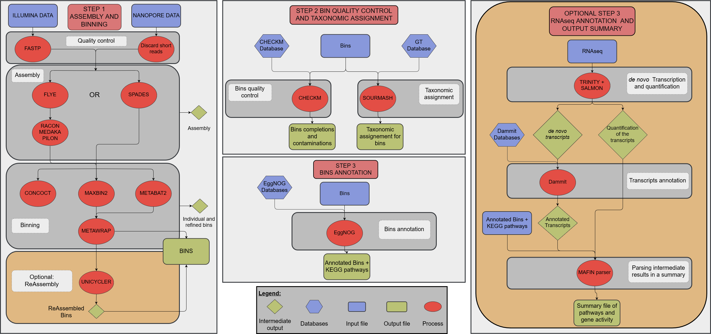

# MAFIN
Metagenomic Assembly pipeline using nextFlow for Illumina and Nanopore reads

# MAFIN is still under development and unstable 

## Introduction

MAFIN aims at being a reproducible pipeline for metagenome assembly
of crossed illumina and nanopore reads.

MAFIN uses the following software

| Task | Software | Version | Docker | integration|
| --- | --- | --- | --- | --- |
| QC illumina | [fastp](https://github.com/OpenGene/fastp) |  |  |  |
| QC ont | automated way to discard shortest reads |  |  |  |
|  | [filtlong](https://github.com/rrwick/Filtlong) |  |  |  |
| metagenomic composition of ont | [sourmash](https://sourmash.readthedocs.io/en/latest/) |  |  |  |
| Hybrid assembly | [Meta-spades](http://cab.spbu.ru/software/spades/) |  |  |  |
|  | [unicycler](https://github.com/rrwick/Unicycler) |  |  |  |
| Long read assembly | [MetaFlye](https://github.com/fenderglass/Flye) |  |  |  |
| polishing | [racon](https://github.com/lbcb-sci/racon) |  |  |  |
|  | [medaka](https://github.com/nanoporetech/medaka) |  |  |  |
|  | [pilon](https://github.com/broadinstitute/pilon/wiki) |  |  |  |
| mapping | [minimap2](https://github.com/lh3/minimap2) |  |  |  |
|  | [bwa](http://bio-bwa.sourceforge.net/) |  |  |  |
|  | [samtools](http://www.htslib.org/) |  |  |  |
| retrieve reads mapped to contig | [seqtk](https://github.com/lh3/seqtk) |  |  |  |
| Binning | [Metabat2](https://bitbucket.org/berkeleylab/metabat/src/master/) |  |  |  |
|  | [maxbin2](https://sourceforge.net/projects/maxbin2/) |  |  |  |
|  | [concoct](https://github.com/BinPro/CONCOCT) |  |  |  |
|  | [metawrap](https://github.com/bxlab/metaWRAP) |  |  |  |
| qc binning | [checkm](https://ecogenomics.github.io/CheckM/) |  |  |  |
|Taxonomic Classification  | [sourmash](https://sourmash.readthedocs.io/en/latest/) using the [gt-DataBase](https://gtdb.ecogenomic.org/) |  |  |  |
| Annotations (bin and RNA) | [eggNOG](https://github.com/eggnogdb/eggnog-mapper/wiki/eggNOG-mapper-v2) |  |  |  |
| *De novo* transcript and quantification | [Trinity](https://github.com/trinityrnaseq/trinityrnaseq/wiki) |  |  |  |
|  | [Salmon](https://github.com/COMBINE-lab/salmon) |  |  |  |

## Figure



## Installation

At the moment to install this pipeline and run this pipeline you need to use the conda installation:
```sh
#install the pipeline
git clone https://github.com/RVanDamme/MAFIN.git

#create an env and install metawrap
conda -y -p /path/to/install/metawrap-env python=2.7
source activate /path/to/install/metawrap-env
conda config --add channels defaults
conda config --add channels conda-forge
conda config --add channels bioconda
conda config --add channels ursky
conda install -y -c ursky metawrap-mg
conda deactivate

#edit MAFIN/modules/metawrap_refine_bin.nf to use the env of metawrap
#you need to change the line 3 and 25 to the path of your env (/path/to/install/metawrap-env)
```

## Usage
the current 2 default usage are:
Spades
```
nextflow run MAFIN/main.nf --output results --assembler metaspades  --illumina fastq_ill/ --nanopore fastq_nano/ --core 2 --memory 16g  -profile conda
```
Flye
```
nextflow run MAFIN/main.nf --output results --assembler metaflye  --illumina fastq_ill/ --nanopore fastq_nano/ --core 2 --memory 16g  -profile conda
```
A more advanced  usage
```
nextflow run MAFIN/main.nf --output results --assembler metaspades  --illumina fastq_ill/ --nanopore fastq_nano/ --core 24 --memory 80g --out_qc --out_metawrap --out_unmapped -profile conda 
```
### Options

#### --cpus
* number of thread available
* default 2

#### --mem
* number of memory available
* default 16g

#### --assembler
* which method to use
* can be Hybrid with metaspades or long read + polishing with metaflye
* required

#### --illumina
* location of the dir containing the forward and reverse illumina reads in fasta or fastq 
* required

#### --nanopore
* location of the dir containing the nanopore reads in fasta or fastq
* required

#### --output
* output directory
* required

### Complete help and options
```
    *********Metagenomic Assembly pipeline using nextFlow for Illumina and Nanopore reads*********

    Mafin is composed of 2 part the retrieval of potential genome and the analysis of said genomes

        Usage example for retrieval:
    nextflow run mafin --retrieve --ont /path/to/ont_dir --illumina /path/to/illumina_dir --metaspades -profile conda
    or 
    nextflow run mafin --retrieve --ont /path/to/ont_dir --illumina /path/to/illumina_dir --metaflye -profile conda

        Input:
    --ont                       path to the directory containing the nanopore read file (fastq)
    -- illumina                 path to the directory containing the illumina read file (fastq)

        Output (default output is reassemblies from each bins):
    --output                    path to the output directory (default: $params.output)
    --assembly                  output the original assembly contigs file (default: false)
    --out_qc                    output the reads file after qc (default: false)
    --out_metabat               output the bins produce by metabat2 (default: false)
    --out_concoct               output the bins produce by concoct (default: false)
    --out_maxbin                output the bins produce by meaxbin2 (default: false)
    --out_metawrap              output the bins produce by metawrap refining (default: false)
    --out_bin_reads             output fastq files containing the reads mapped to each bin (default: false)
    --out_unmapped              output sorted bam files containing the unmmaped reads of illumina and nanopore (default:false)


    

        Parameter:
    --cpus                      max cores for local use [default: $params.cpus]
    --memory                    80% of available RAM in GB for --metamaps [default: $params.memory]
    
        Options:
    --checkm_db                 path to an already INSTALLED checkm database (not the tar file)
    --checkm_tar_db             path to the tar checkm database (it will extract it in the dir)
    --sourmash                  path to an already installed sourmash database
    --skip_ill_qc               skip quality control of illumina files
    --skip_ont_qc               skip quality control of nanopore file
    --short_qc                  minimum size of the reads to be kept (default: $params.short_qc )
    --filtlong                  use filtlong to improve the quality furthermore (default: false)
    --model                     the model medaka will use (default: r941_min_high)
    --polish_iteration          number of iteration of pilon in the polish step (advanced)
    --extra_ill                 a list of additional ill sample file (with full path with a * instead of _R1,2.fastq) to use for the binning in Metabat2 and concoct
    --extra_ont                 a list of additional ont sample file (with full path) to use for the binning in Metabat2 and concoct
    TBD --SRA_ill                   a list of additional ill sample from SRA accession number to use for the binning in Metabat2 and concoct
    TBD --SRA_ont                   a list of additional ont sample from SRA accession number to use for the binning in Metabat2 and concoct
    --skip_metabat2             skip the binning using metabat2 (advanced)
    --skip_maxbin2              skip the binning using maxbin2 (advanced)
    --skip_concoct              skip the binning using concoct (advanced)

        Nextflow options:
    -profile                    change the profile of nextflow (currently available conda)
    -with-report rep.html       cpu / ram usage (may cause errors)
    -with-dag chart.html        generates a flowchart for the process tree
    -with-timeline time.html    timeline (may cause errors)
```
## BIBLIOGRAPHY

BWA: Li H. and Durbin R. (2009) Fast and accurate short read alignment with Burrows-Wheeler Transform. Bioinformatics, 25:1754-60. [PMID: 19451168] 

CheckM: Parks DH, Imelfort M, Skennerton CT, Hugenholtz P, Tyson GW. 2015. CheckM: assessing the quality of microbial genomes recovered from isolates, single cells, and metagenomes. Genome Research, 25: 1043–1055.

Concoct: Johannes Alneberg, Brynjar Smári Bjarnason, Ino de Bruijn, Melanie Schirmer, Joshua Quick, Umer Z Ijaz, Leo Lahti, Nicholas J Loman, Anders F Andersson & Christopher Quince. 2014. Binning metagenomic contigs by coverage and composition. Nature Methods, doi: 10.1038/nmeth.3103 

Fastp: Shifu Chen, Yanqing Zhou, Yaru Chen, Jia Gu; fastp: an ultra-fast all-in-one FASTQ preprocessor, Bioinformatics, Volume 34, Issue 17, 1 September 2018, Pages i884–i890, https://doi.org/10.1093/bioinformatics/bty560

Filtlong: https://github.com/rrwick/Filtlong

Flye: Mikhail Kolmogorov, Jeffrey Yuan, Yu Lin and Pavel Pevzner, "Assembly of Long Error-Prone Reads Using Repeat Graphs", Nature Biotechnology, 2019 doi:10.1038/s41587-019-0072-8

HMMER: http://hmmer.org/ 

Maxbin2: Wu YW, Tang YH, Tringe SG, Simmons BA, and Singer SW, "MaxBin: an automated binning method to recover individual genomes from metagenomes using an expectation-maximization algorithm", Microbiome, 2:26, 2014.

Medaka: https://github.com/nanoporetech/medaka

Metabat2: Kang DD, Froula J, Egan R, Wang Z. MetaBAT, an efficient tool for accurately reconstructing single genomes from complex microbial communities. PeerJ 2015;3:e1165. doi:10.7717/peerj.1165

Metawrap: Uritskiy, G.V., DiRuggiero, J. and Taylor, J. (2018). MetaWRAP—a flexible pipeline for genome-resolved metagenomic data analysis. Microbiome, 6(1). https://doi.org/10.1186/s40168-018-0541-1

Minimap2: Li, H. (2018). Minimap2: pairwise alignment for nucleotide sequences. Bioinformatics, 34:3094-3100. doi:10.1093/bioinformatics/bty191

Pilon: Bruce J. Walker, Thomas Abeel, Terrance Shea, Margaret Priest, Amr Abouelliel, Sharadha Sakthikumar, Christina A. Cuomo, Qiandong Zeng, Jennifer Wortman, Sarah K. Young, Ashlee M. Earl (2014) Pilon: An Integrated Tool for Comprehensive Microbial Variant Detection and Genome Assembly Improvement. PLoS ONE 9(11): e112963. doi:10.1371/journal.pone.0112963

pplacer: Matsen FA, Kodner RB, Armbrust EV. 2010. pplacer: linear time maximum-likelihood and Bayesian phylogenetic placement of sequences onto a fixed reference tree. BMC Bioinformatics 11: doi:10.1186/1471-2105-11-538.

prodigal: Hyatt D, Locascio PF, Hauser LJ, Uberbacher EC. 2012. Gene and translation initiation site prediction in metagenomic sequences. Bioinformatics 28: 2223–2230.

Racon: Vaser R, Sovic I, Nagarajan N, Sikic M. 2017. Fast and accurate de novogenome assembly from long uncorrected reads. Genome Res 27:737–746.https://doi.org/10.1101/gr.214270.116

Samtools: Li H, Handsaker B, Wysoker A, Fennell T, Ruan J, Homer N, Marth G, Abecasis G, Durbin R, and 1000 Genome Project Data Processing Subgroup, The Sequence alignment/map (SAM) format and SAMtools, Bioinformatics (2009) 25(16) 2078-9 [19505943]

Seqtk: https://github.com/lh3/seqtk

Sourmash: Brown et al, (2016), sourmash: a library for MinHash sketching of DNA, Journal of Open Source Software, 1(5), 27, doi:10.21105/joss.00027

Spades:  Lapidus A., Antipov D., Bankevich A., Gurevich A., Korobeynikov A., Nurk S., Prjibelski A., Safonova Y., Vasilinetc I., Pevzner P. A. New Frontiers of Genome Assembly with SPAdes 3.0.	(poster), 2014 

Unicycler: Wick RR, Judd LM, Gorrie CL, Holt KE (2017) Unicycler: Resolving bacterial genome assemblies from short and long sequencing reads. PLoS Comput Biol 13(6): e1005595. https://doi.org/10.1371/journal.pcbi.1005595

## License

Code is [GPL-3.0](LICENSE)

## Contributing

We welcome contributions from the community! See our
[Contributing](CONTRIBUTING.md) guidelines
